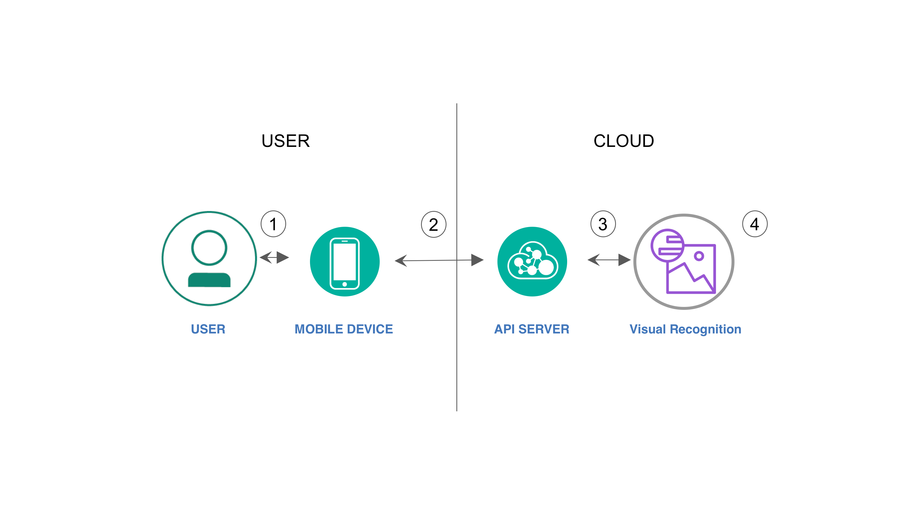
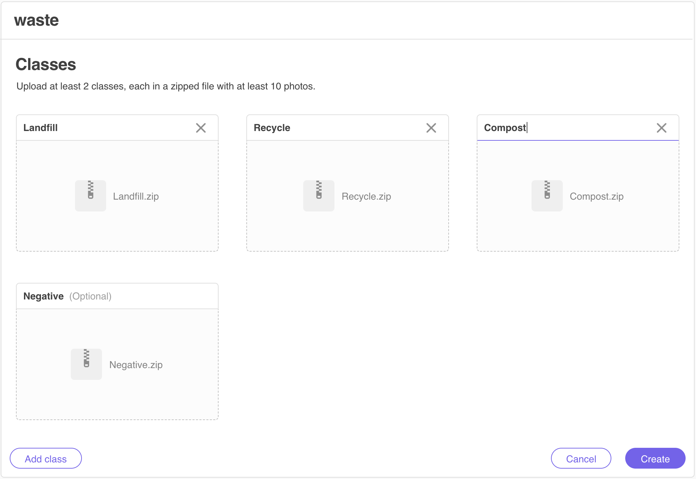
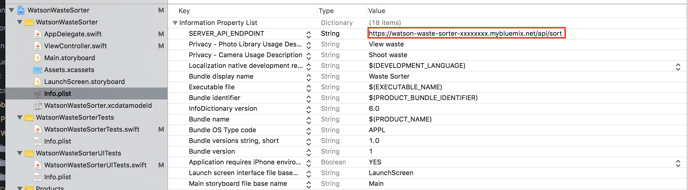

[](https://travis-ci.org/IBM/watson-waste-sorter)


# watson-waste-sorter
***Work in progress***

In this developer code pattern, we will create a mobile app, Python Server with Flask, and Watson Visual Recognition. This mobile app sends pictures of waste and garbage to be analyzed by a server app, using Watson Visual Recognition. The server application will use pictures of common trash to train Watson Visual Recognition to identify various catagories of waste, i.e. recycle, compost, or landfill. A developer can leverage this to create their own custom Visual Recognition classifiers for their use cases.

When the reader has completed this Code Pattern, they will understand how to:
- Create a Python server with Flask that can utilize the Watson Visual Recognition service for classifying images.
- Create a Visual Recognition custom classifier using the Web UI or command line.
- Create a mobile application that can send pictures to a server app for classification using Visual Recognition.



## Flow

1. User interacts with the mobile app and captures an image.
2. The image on the mobile phone is passed to the server application running in the cloud.
3. The server sends the image to Watson Visual Recognition Service for analysis and sends back the classification result to the mobile app.
4. Visual Recognition service classifies the image and returns the information to the server.

## Included components

* [Watson Visual Recognition](https://www.ibm.com/watson/developercloud/visual-recognition.html): Visual Recognition understands the contents of images - visual concepts tag the image, find human faces, approximate age and gender, and find similar images in a collection.

## Featured Technologies

* Mobile: Systems of engagement are increasingly using mobile technology as the platform for delivery.
* [Flask](http://flask.pocoo.org/): A micro webdevelopment framework for Python.

# Prerequisite

Create an [IBM Cloud account](https://console.bluemix.net/registration/) and install the [Cloud Foundry CLI](https://docs.cloudfoundry.org/cf-cli/install-go-cli.html) on your machine.

## Deploy the Server Application to IBM Cloud

[](https://console.ng.bluemix.net/devops/setup/deploy/?repository=https://github.com/IBM/watson-waste-sorter)

# Steps

## 1. Create your custom visual recognition model.

First, we need to login to the Cloud Foundry CLI.
```shell
cf login -a https://api.ng.bluemix.net # Please use a different API endpoint if your IBM Cloud account is not in US-South
```

Next, provision a Free tier [Visual Recognition](https://console.bluemix.net/catalog/services/visual-recognition)
Service and name it `visual-recognition-wws`. You can provision it using the above link or the command below.
```shell
cf create-service watson_vision_combined free visual-recognition-wws
```

### Create custom model via Web UI

After you provision the Visual Recognition service, create a new credential under the `Service credentials` tab on the left side of the Web UI. Now, you should see the `api_key` for the service. Use it to access the [Visual Recognition Tool](https://watson-visual-recognition.ng.bluemix.net/) Web UI and create your own custom visual recognition model.

In the Visual Recognition Tool, click `Create classifier`. Then, upload the zipped image files from `server/resources` to the corresponding class as shown below. Make sure you name your classifier ``waste`` and the three classes should be ``Landfill``, ``Recycle``, and ``Compost``. (All the names should be case sensitive).



Click `Create` after you uploaded all the files to the corresponding class. Now the visual recognition should start training the new custom model. The training process should take about 20 to 30 minutes, so you can start deploying the server and mobile app while waiting for it.

### Create custom model via command line

After you provision the Visual Recognition service, run the following command to create your Visual Recognition API KEY
```shell
cf create-service-key visual-recognition-wws waste-sorter
API_KEY=$(cf service-key visual-recognition-wws waste-sorter --guid | tr -d "-")
```

Now go to the server directory. Let's create our custom model using the sample zipped image files we have under `server/resources`
```shell
cd server
echo $API_KEY # Make sure your API_KEY is not empty
curl -X POST -F "Landfill_positive_examples=@resources/landfill.zip" -F "Recycle_positive_examples=@resources/recycle.zip" -F "Compost_positive_examples=@resources/compost.zip" -F "negative_examples=@resources/negative.zip" -F "name=waste" "https://gateway-a.watsonplatform.net/visual-recognition/api/v3/classifiers?api_key=$API_KEY&version=2016-05-20"
```


## 2. Deploy the server application

Now in the server repository, push your server application to Cloud Foundry
```
cf push
```

Once the deployment is success, your backend server should be running on the cloud and able to classify the different kind of waste once the model finish training. Please take a note with your server application's endpoint as you will need it in the next step. Now let's go ahead and create our mobile app to use this classifier.

## 3. Create the mobile application and connect it with the server

In order to test the full features for this application, you need to have [Xcode 8.0 and above](https://developer.apple.com/xcode/) installed and an IOS device to deploy the application.

Now Open your Xcode and select `Open another project...`, then select the `mobile-app/WatsonWasteSorter.xcworkspace` file and click `Open`.

Next, you need to modify the `WatsonWasteSorter/Info.plist` with the endpoint of the API server you just deployed. Replace the `SERVER_API_ENDPOINT`'s value section
with your server endpoint with extension `/api/sort`.



Next, you will need to sign your application with your Apple account. Go to the mobile app's `General` section, under `Signing`'s Team select your team or add an account. Now your mobile app is signed and you are ready to deploy your Waste Sorter app.

> Note: If you have trouble to Sign your Mobile app, please refer to https://help.apple.com/xcode/mac/current/#/dev60b6fbbc7

Now, Connect your IOS device to your machine and select your device in Xcode. Click the run icon and your mobile app should be installed on your device.

## 4. Using the Waste Sorter mobile application

Congratulation, at this point you should have an mobile app that can classify wastes using your camera. Now you can just simply point your camera to any waste
and click the camera icon to take a picture. Then the application should tell you where the waste should go like this.


Now you should have a better idea on how to sort your trash. Note that if you have a result that said `unclassified`, it means your image is too blurry or the
waste is too far. In that case just simply point your camera closer and retake a new picture.
> If you want to classify another waste, simply click the center of the screen.

# Troubleshooting

## Privacy Notice

If using the Deploy to IBM Cloud button some metrics are tracked, the following information is sent to a [Deployment Tracker](https://github.com/IBM/metrics-collector-service) service on each deployment:

* Python package version
* Python repository URL
* Application Name (`application_name`)
* Application GUID (`application_id`)
* Application instance index number (`instance_index`)
* Space ID (`space_id`) or OS username
* Application Version (`application_version`)
* Application URIs (`application_uris`)
* Cloud Foundry API (`cf_api`)
* Labels of bound services
* Number of instances for each bound service and associated plan information
* Metadata in the repository.yaml file

This data is collected from the `setup.py` and `repository.yaml` file in the sample application and the `VCAP_APPLICATION` and `VCAP_SERVICES` environment variables in IBM Cloud and other Cloud Foundry platforms. This data is used by IBM to track metrics around deployments of sample applications to IBM Cloud to measure the usefulness of our examples, so that we can continuously improve the content we offer to you. Only deployments of sample applications that include code to ping the Deployment Tracker service will be tracked.

## Disabling Deployment Tracking

To disable tracking, simply remove ``metrics_tracker_client.track()`` from the ``run.py`` file in the server directory.

# License

[Apache 2.0](LICENSE)
