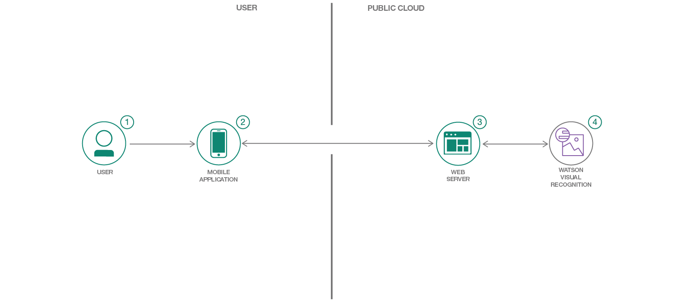

[](https://travis-ci.org/IBM/watson-waste-sorter)

# Create a custom Visual Recognition classifier for sorting waste

In this developer code pattern, we will create a mobile app, Python Server with Flask, and Watson Visual Recognition. This mobile app sends pictures of waste and garbage to be analyzed by a server app, using Watson Visual Recognition. The server application will use pictures of common trash to train Watson Visual Recognition to identify various categories of waste, e.g. recycle, compost, or landfill. A developer can leverage this to create their own custom Visual Recognition classifiers for their use cases.

When the reader has completed this Code Pattern, they will understand how to:
- Create a Python server with Flask that can utilize the Watson Visual Recognition service for classifying images.
- Create a Visual Recognition custom classifier using the Web UI or command line.
- Create a mobile application that can send pictures to a server app for classification using Visual Recognition.



## Flow

1. User interacts with the mobile app and captures an image.
2. The image on the mobile phone is passed to the server application running in the cloud.
3. The server sends the image to Watson Visual Recognition Service for analysis and sends back the classification result to the mobile app.
4. Visual Recognition service classifies the image and returns the information to the server.

## Included components

* [Watson Visual Recognition](https://www.ibm.com/watson/developercloud/visual-recognition.html): Visual Recognition understands the contents of images - visual concepts tag the image, find human faces, approximate age and gender, and find similar images in a collection.

## Featured Technologies

* Mobile: Systems of engagement are increasingly using mobile technology as the platform for delivery.
* [Flask](http://flask.pocoo.org/): A micro web development framework for Python.

# Watch the Video
[](https://youtu.be/0yWE8eClrxU)

# Prerequisite

Create an [IBM Cloud account](https://console.bluemix.net/registration/) and install the [Cloud Foundry CLI](https://docs.cloudfoundry.org/cf-cli/install-go-cli.html) on your machine.

# Steps
1. [Create your visual recognition service](#1-create-your-visual-recognition-service)
2. [Deploy the server application](#2-deploy-the-server-application)
3. [Create the mobile application and connect it to the server](#3-create-the-mobile-application-and-connect-it-to-the-server)
4. [Using the Waste Sorter mobile application](#4-using-the-waste-sorter-mobile-application)

## Deploy the Server Application to IBM Cloud

You can either go through [Step 1 and 2](#1-create-your-visual-recognition-service) to create your application server, or

You can simply click the `Deploy to IBM Cloud` button and `Create` the toolchain to provision, train, and run your visual recognition server.
Then, go to the [IBM Cloud Dashboard](https://console.bluemix.net/dashboard/apps/) to verify your server is running and take note of your
server application's endpoint. Once you done that, you can move on to [Step 3](#3-create-the-mobile-application-and-connect-it-to-the-server)
and deploy your mobile application.

[](https://console.ng.bluemix.net/devops/setup/deploy/?repository=https://github.com/IBM/watson-waste-sorter)

## 1. Create your visual recognition service

First, we need to clone this repository
```shell
git clone https://github.com/IBM/watson-waste-sorter
cd watson-waste-sorter
```

Then, we need to login to the Cloud Foundry CLI.
```shell
cf login -a https://api.ng.bluemix.net # Please use a different API endpoint if your IBM Cloud account is not in US-South
```

Next, provision a Lite tier [Visual Recognition](https://console.bluemix.net/catalog/services/visual-recognition)
Service and name it `visual-recognition-wws`. You can provision it using the above link or the command below.
```shell
cf create-service watson_vision_combined lite visual-recognition-wws
```

## 2. Deploy the server application

Now go to the server repository, push your server application to Cloud Foundry
```
cd server
cf push
```

Once the deployment succeeds, your backend server will create the custom model and be able to classify the different kinds of waste once the model finishes training. Please take note of your server application's endpoint as you will need it in the next step. Now let's go ahead and create our mobile app to use this classifier.

## 3. Create the mobile application and connect it to the server

In order to test the full features for this application, you need to have [Xcode 8.0 or above](https://developer.apple.com/xcode/) installed and an IOS device to deploy the application.

Now Open your Xcode and select `Open another project...`, then select the `mobile-app/WatsonWasteSorter.xcworkspace` file and click `Open`.

Next, you need to modify the `WatsonWasteSorter/Info.plist` with the endpoint of the API server you just deployed. Replace the `SERVER_API_ENDPOINT`'s value section
with your server endpoint with extension `/api/sort`.


Next, you will need to sign your application with your Apple account. Go to the mobile app's `General` section, under `Signing`'s Team select your team or add an account. Now your mobile app is signed and you are ready to deploy your Waste Sorter app.

> Note: If you have trouble signing your Mobile app, please refer to https://help.apple.com/xcode/mac/current/#/dev60b6fbbc7

Now, connect your IOS device to your machine and select your device in Xcode. Click the run icon and your mobile app will be installed on your device.

## 4. Using the Waste Sorter mobile application

Congratulations, at this point you should have a mobile app that can classify waste using your camera. Now you can just simply point your camera to any waste
and click the camera icon to take a picture. Then the application should tell you where the waste should go like this.


Now you should have a better idea on how to sort your trash. Note that if you have a result that said `unclassified`, it means your image is either too blurry or the
waste is too far. In that case just simply point your camera closer and retake a new picture.
> If you want to classify another waste item, simply click the center of the screen.

# Troubleshooting

* To clean up, simply delete your mobile app. Then you can delete your server application via the [IBM Cloud Dashboard](https://console.bluemix.net/dashboard/apps/).

# Links
* [Demo on Youtube](https://youtu.be/0yWE8eClrxU)
* [Use Watson Visual Recognition with Android](https://github.com/IBM/watson-vehicle-damage-analyzer)
* [Sample code: Recognize and identify faces in an image with the Watson Visual Recognition service.](http://www.ibm.com/developerworks/java/library/cc-sample-code-facial-recognition-watson-node/index.html)
* [Best practices for using custom classifiers in Watson Visual Recognition](http://www.ibm.com/developerworks/library/cc-build-with-watson-tips-best-practices-custom-classifiers-visual-recognition/index.html)

# Learn more

* **Artificial Intelligence Code Patterns**: Enjoyed this Code Pattern? Check out our other [AI Code Patterns](https://developer.ibm.com/code/technologies/artificial-intelligence/).
* **AI and Data Code Pattern Playlist**: Bookmark our [playlist](https://www.youtube.com/playlist?list=PLzUbsvIyrNfknNewObx5N7uGZ5FKH0Fde) with all of our Code Pattern videos
* **With Watson**: Want to take your Watson app to the next level? Looking to utilize Watson Brand assets? [Join the With Watson program](https://www.ibm.com/watson/with-watson/) to leverage exclusive brand, marketing, and tech resources to amplify and accelerate your Watson embedded commercial solution.

# License

This code pattern is licensed under the Apache Software License, Version 2. Separate third party code objects invoked within this code pattern are licensed by their respective providers pursuant to their own separate licenses. Contributions are subject to the Developer [Certificate of Origin, Version 1.1 (“DCO”)] (https://developercertificate.org/) and the [Apache Software License, Version 2]( (http://www.apache.org/licenses/LICENSE-2.0.txt).

ASL FAQ link: http://www.apache.org/foundation/license-faq.html#WhatDoesItMEAN